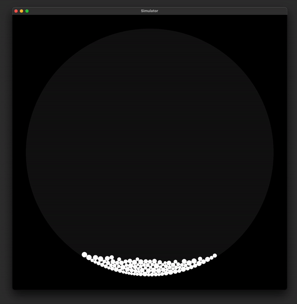

# Simulation

A physics partical simulation project written in c and opengl 



## To run

You have to have OpenGL, GLFW, c and make installed after which all you have to do is 
```
git clone https://github.com/vasilybib1/simulation
cd simulation
make
./simulation
```

